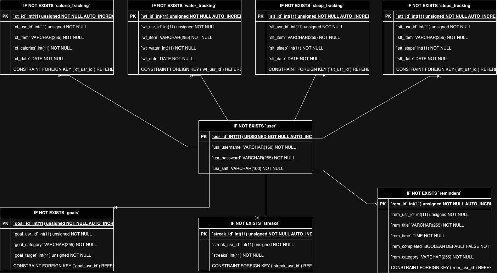

# Movemate

## Project Startup

In MoveMate root directory type:

* docker compose build
* docker compose up
* Navigate to localhost in a browser window

## Features

* User Authentication
* Welcome Popup (Adding user goals for new users)
* Goals Page
* User Streaks
* Goal Categories Pages (Editing targets, adding items, deleting items)
* Reminders Page (Setting reminders, history page)
* Recommendations Page (AI based)

## Authentication & Authorization

Using token authentication with jwt helpers methods (sign, verify) to store active user data. From there, current user id is passed into DAO methods to access rows in database tables with the corresponding user id.

## PWA Capabilities

- Used Movemate logo for icons and black and white theming to stay consistent with overall app scheme.
- Allow users to view their recommendations while being offline.
- Allow users to view their reminders while being offline.
- Allow users to view their current goals and their progress towards them while being offline

## API Documentation

Method | Route                 | Description
------ | --------------------- | ---------
`POST` | `/register`           | Creates a new user account and returns the new user object
`POST` | `/login`              | Receives username and password
`POST` | `/logout`             | Log out the current user
`GET`  | `/users/current`      | Retrieves current user
`POST` | `/goals`              | Adds to users goals
`GET`  | `/goals`              | Retrieves users goals
`POST` | `/reminders`          | Adds to users reminders
`GET`  | `/reminders`          | Retrieves users reminders 
`POST` | `/calories`           | Adds to users calories info
`GET`  | `/calories`           | Retrieves users calories info
`POST` | `/water`              | Adds to users water info
`GET`  | `/water`              | Retrieves users water info
`POST` | `/sleep`              | Adds to users sleep info
`GET`  | `/sleep`              | Retrieves users sleep info
`POST` | `/steps`              | Adds to users steps info
`GET`  | `/steps`              | Retrieves users steps info
`GET`  | `/streaks`            | Retrives users daily streaks
`POST` | `/userGoals`          | Adds user goals
`GET`  | `/userGoals`          | Retrieved user goals

## Database ER Diagram

